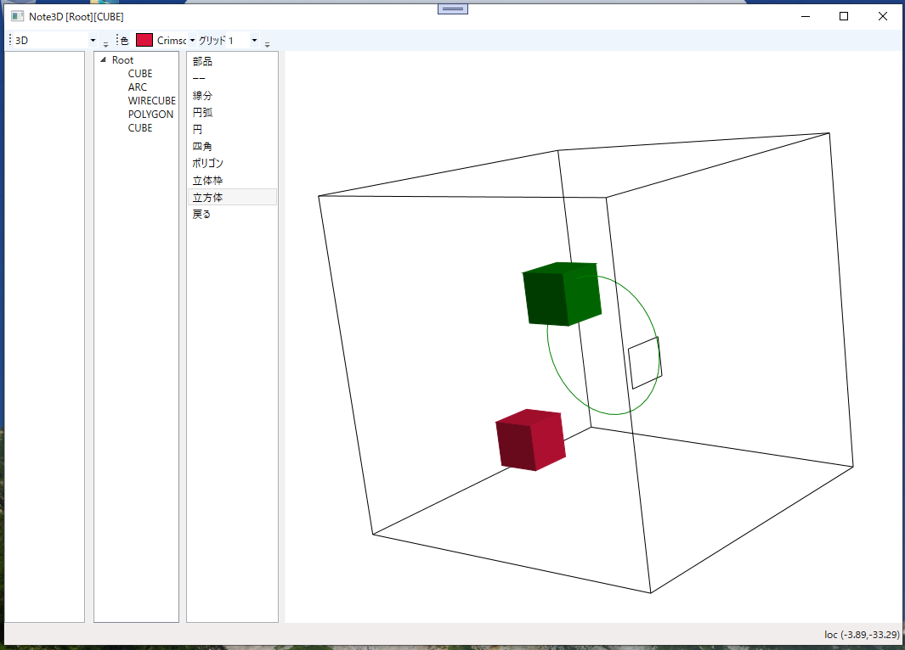

# Note3DApp
## 3Dライブラリを使わ緯でつくる3D CADソフトのようなもの

OpenGLやDirectXなどの3Dライブラリを使わずに3D CADのようなものを作成する  
機能は作りながら考えていく。
まずはサーフェス、Zオーダーで表示する。

### 起動画面(とりあえず)
  

### 履歴
2023/12/25 プロトタイプの原型をアップロード

### ■実行環境
[Note3DApp.zip](Note3DApp.zip)をダウンロードして適当なフォルダに展開し、フォルダ内の Note3DApp.exe をダブルクリックして実行します。  
動作環境によって「.NET 7.0 Runtime」が必要になる場合もあります。  
https://dotnet.microsoft.com/ja-jp/download

### ■開発環境  
開発ソフト : Microsoft Visual Studio 2022  
開発言語　 : C# 10.0 Windows アプリケーション  
フレームワーク　 :  .NET 7.0  
NuGetライブラリ : なし  
自作ライブラリ  : CoreLib (Y3DDraw.cs : 3D Surface ライブラリ)
